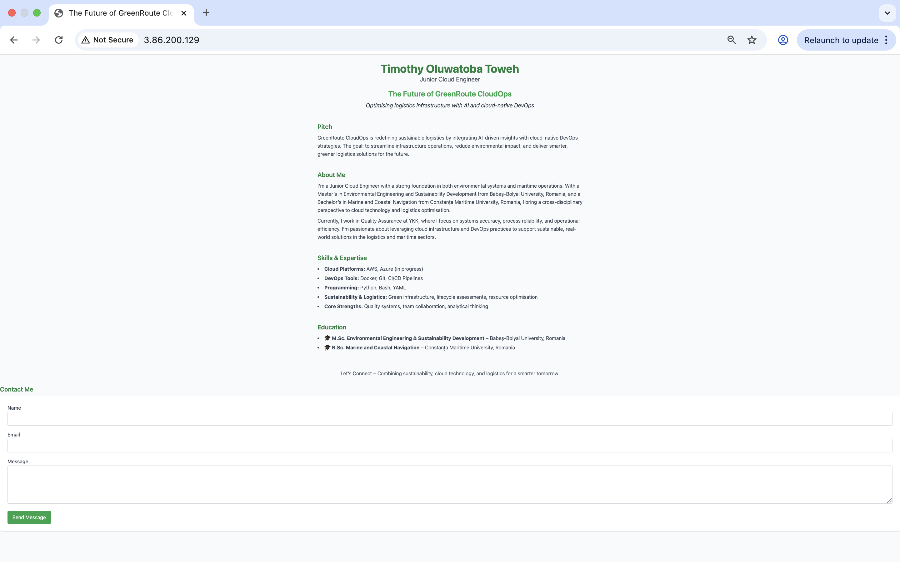

# 🌱 GreenRoute CloudOps – DevOps Pitch Page

## 🌐 Live Demo
Access the hosted project here:  
**http://3.86.200.129/**

## 📸 Screenshot



## 🧩 Project Overview

GreenRoute CloudOps is a cloud-native pitch page showcasing how AI, DevOps, and sustainable logistics can intersect. This simple Node.js app serves a responsive HTML page styled with TailwindCSS, and includes a functional contact form.

Visitors can learn about the vision, background, and skills of Timothy Oluwatoba Toweh, and submit messages directly through the page.

---

## 🚀 Deployment Process

### 🔧 1. Cloud Server Setup

- **Platform:** Amazon EC2 (Ubuntu 22.04)
- **Accessed via SSH:**  
  ```bash
  ssh -i "key-example.pem" ubuntu@3.86.200.129

Installed essential tools:
sudo apt update
sudo apt install nodejs npm nginx
sudo npm install -g pm2

🛠️  2. Application Setup
Created a project directory startup-app

Wrote index.js to:

Serve static HTML from the /public folder

Handle POST requests from the contact form

Log messages to messages.log

Set up the HTML page in public/index.html with TailwindCSS via CDN

Example route:
app.post('/contact', (req, res) => {
  const { name, email, message } = req.body;
  // Logs message to a file
});

🌐 3. Web Server Configuration (Nginx)
Used Nginx as a reverse proxy to route HTTP requests on port 80 to the Node.js app running on port 3000.

Config snippet in /etc/nginx/sites-enabled/default:
server {
    listen 80;
    server_name _;

    location / {
        proxy_pass http://localhost:3000;
        proxy_http_version 1.1;
        proxy_set_header Upgrade $http_upgrade;
        proxy_set_header Connection 'upgrade';
        proxy_set_header Host $host;
        proxy_set_header X-Real-IP $remote_addr;
        proxy_set_header X-Forwarded-For $proxy_add_x_forwarded_for;
        proxy_set_header X-Forwarded-Proto $scheme;
        proxy_cache_bypass $http_upgrade;
    }
}


Reloaded Nginx:
sudo systemctl restart nginx

⚙️  4. Running the App with PM2
Started the Node.js server with PM2:
pm2 start index.js --name index
pm2 save

📥 5. Contact Form Functionality
HTML form sends a POST request to /contact

Server logs each message to:

Console logs (seen via pm2 logs index)

A messages.log file on the server

Example message:
[2025-06-15T12:03:45Z] Name: John Doe, Email: john@example.com
Message: Hello! Great pitch.


✨ Author
Timothy Oluwatoba Toweh
Junior Cloud Engineer
Passionate about cloud infrastructure, green technology, and intelligent logistics systems.

